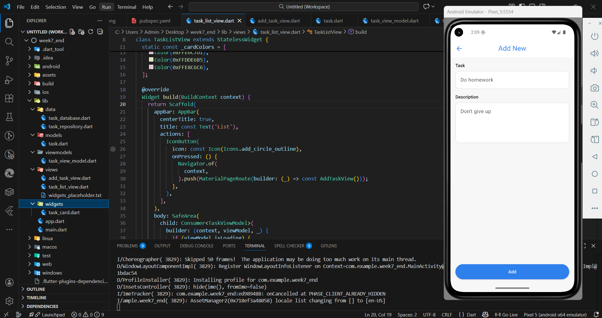

# UTH SmartTasks (Week 7)

Ứng dụng quản lý công việc (todo) đơn giản, lưu trữ cục bộ bằng SQLite, giao diện Material 3.

## Công nghệ sử dụng

- Flutter (Material 3 UI)
- Dart SDK ^3.10.7
- Provider (quản lý trạng thái với `ChangeNotifier`)
- Sqflite (SQLite local database)
- Path (xử lý đường dẫn DB)

## Kiến trúc & cấu trúc thư mục

Dự án tổ chức theo hướng MVVM đơn giản:

- `lib/models`: model dữ liệu (`Task`)
- `lib/data`: tầng lưu trữ (`TaskDatabase`, `TaskRepository`)
- `lib/viewmodels`: logic điều khiển (`TaskViewModel`)
- `lib/views`: màn hình UI (`TaskListView`, `AddTaskView`)
- `lib/widgets`: widget tái sử dụng (`TaskCard`)

## Chức năng chính

- Hiển thị danh sách công việc đã lưu
- Thêm công việc mới (tiêu đề + mô tả)
- Xóa công việc bằng thao tác kéo (Dismissible)
- Lưu dữ liệu bền vững bằng SQLite

## hình ảnh minh họa

## Các bước đã thực hiện trong bài

1. Khởi tạo dự án Flutter.
2. Cài đặt các package cần thiết: `provider`, `sqflite`, `path`.
3. Xây dựng model `Task` và mapping DB (`toMap`, `fromMap`).
4. Tạo SQLite database với bảng `tasks` và các cột:
    - `id` (INTEGER, PK, AUTOINCREMENT)
    - `title` (TEXT)
    - `description` (TEXT)
    - `created_at` (INTEGER)
5. Tạo `TaskRepository` để thao tác CRUD (get/add/delete).
6. Xây dựng `TaskViewModel` với `ChangeNotifier` để quản lý trạng thái:
    - Tải dữ liệu khi khởi tạo
    - Thêm/xóa task và cập nhật UI
7. Thiết kế UI:
    - `TaskListView`: danh sách task, nút thêm, hiệu ứng xóa kéo
    - `AddTaskView`: form nhập liệu, validate, nút lưu
    - `TaskCard`: card hiển thị task với màu nền xen kẽ
8. Tối ưu giao diện bằng Material 3 và theme tùy chỉnh.

## Hướng dẫn chạy dự án

1. Cài Flutter SDK và cấu hình thiết bị/giả lập.
2. Cài dependencies:
    - `flutter pub get`
3. Chạy ứng dụng:
    - `flutter run`

## Ghi chú

- Dữ liệu được lưu cục bộ trong SQLite, không cần mạng.
- Danh sách task được sắp xếp theo thời gian tạo (mới nhất trước).
